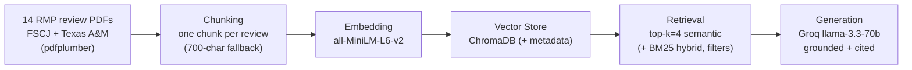

# Project 1 Planning: The Unofficial Guide

> Write this document before you write any pipeline code.
> Your spec and architecture diagram are what you'll use to direct AI tools (Claude, Copilot, etc.) to generate your implementation — the more specific they are, the more useful the generated code will be.
> Update the Retrieval Approach and Chunking Strategy sections if you change your approach during implementation.
> Update this file before starting any stretch features.

---

## Domain

Student reviews of CS professors and courses at **two schools — Florida State College at
Jacksonville (FSCJ) and Texas A&M University**. This knowledge is valuable because official
course catalogs describe *content* but never *teaching style, exam difficulty, grading fairness,
workload, or which professor actually gives useful feedback* — exactly what students weigh when
choosing a section. It is hard to find through official channels because it lives scattered across
Rate My Professors in inconsistent, opinion-heavy, unstructured form. Spanning two schools also
means a question may name a professor at a *specific* school, so the school is tracked as metadata
to keep professors from different schools cleanly separated.

---

## Documents

**14 Rate My Professors review pages**, one PDF per CS professor, covering two schools — 8 at
Florida State College at Jacksonville and 6 at Texas A&M University. Each PDF is a single
professor's full RMP page (printed to PDF), so each file contains *many* individual student
reviews spanning multiple courses and years. The set deliberately mixes highly-rated and
poorly-rated professors so the corpus answers a range of questions rather than 14 near-duplicate
endorsements. The filename (professor name, with `texasA&M` tagged on the A&M files) and the
`school` field become the source-attribution metadata. Full source URLs are also listed in
`document_source_link.txt`.

| # | Professor | School | Source | File | RMP URL |
|---|-----------|--------|--------|------|---------|
| 1 | Donald Lafond | FSCJ | Rate My Professors | `documents/donald-lafond_reviews.pdf` | https://www.ratemyprofessors.com/professor/394993 |
| 2 | Kevin Hampton | FSCJ | Rate My Professors | `documents/kevin-hampton_reviews.pdf` | https://www.ratemyprofessors.com/professor/355109 |
| 3 | Sebena Masline | FSCJ | Rate My Professors | `documents/sebena-masline_reviews.pdf` | https://www.ratemyprofessors.com/professor/103853 |
| 4 | Gail Gehrig | FSCJ | Rate My Professors | `documents/gail-gehrig_reviews.pdf` | https://www.ratemyprofessors.com/professor/1134669 |
| 5 | Andrea McKeon | FSCJ | Rate My Professors | `documents/andrea-mcKeon_reviews.pdf` | https://www.ratemyprofessors.com/professor/392720 |
| 6 | Rosalyn Amaro | FSCJ | Rate My Professors | `documents/rosalyn-amaro_reviews.pdf` | https://www.ratemyprofessors.com/professor/276065 |
| 7 | Steven Difranco | FSCJ | Rate My Professors | `documents/steven-difranco_reviews.pdf` | https://www.ratemyprofessors.com/professor/194733 |
| 8 | Cheryl Schmidt | FSCJ | Rate My Professors | `documents/cheryl-schmidt_reviews.pdf` | https://www.ratemyprofessors.com/professor/290506 |
| 9 | Shreyas Kumar | Texas A&M | Rate My Professors | `documents/shreyas-kumar_texasA&M_reviews.pdf` | https://www.ratemyprofessors.com/professor/3041478 |
| 10 | Philip Ritchey | Texas A&M | Rate My Professors | `documents/philip-ritchey_texasA&M_reviews.pdf` | https://www.ratemyprofessors.com/professor/2012889 |
| 11 | Hyunyoung Lee | Texas A&M | Rate My Professors | `documents/hyunyoung-lee_texasA&M_reviews.pdf` | https://www.ratemyprofessors.com/professor/2046254 |
| 12 | Teresa Leyk | Texas A&M | Rate My Professors | `documents/teresa-leyk_texasA&M_reviews.pdf` | https://www.ratemyprofessors.com/professor/609101 |
| 13 | Robert Lightfoot | Texas A&M | Rate My Professors | `documents/robert-lightfoot_texasA&M_reviews.pdf` | https://www.ratemyprofessors.com/professor/2327118 |
| 14 | Aakash Tyagi | Texas A&M | Rate My Professors | `documents/aakash-tyagi_texasA&M_reviews.pdf` | https://www.ratemyprofessors.com/professor/1967267 |

---

## Chunking Strategy

All 14 documents are PDFs, loaded with **pdfplumber** (`extract_text()` per page). Confirmed during
Milestone 1 that every PDF has a real text layer (18k–68k extracted chars each; no OCR needed).

**Chunk size:** One chunk **per individual student review**. Each RMP review is a self-contained
unit delimited in the extracted text by a header line carrying a course code + date (e.g.
`CET2600 Apr 26th, 2025`) followed by `QUALITY`/`DIFFICULTY` ratings and the comment body. The
chunker splits on these review-boundary markers (course-code + date regex) and keeps each review —
plus its course code, date, ratings, "Would Take Again", and grade — together as one chunk.

**Overlap:** **None** between reviews — each review is already a complete, independent opinion, so
overlap would only duplicate content. A **~700-char / ~120-char-overlap sliding window** is kept
only as a *fallback* for any stretch of text where the course/date markers can't be detected (so no
content is silently dropped).

**Reasoning:** Reviews are short, self-contained opinions (1–3 sentences). One-chunk-per-review
keeps a complete, retrievable thought intact — splitting mid-review produces meaningless fragments
("Professor Smith's exams are heavily"), while merging many reviews into one chunk dilutes the
embedding so specific queries can't match precisely.

**Preprocessing (before chunking)** — the extracted RMP text is noisy, with page headers/footers
and UI text interleaved into the reviews. Strip: the rating-distribution / "Similar Professors"
sidebar, repeated per-page headers (professor name + "Computer Science" + school line, sometimes
mangled like `Florida State College at JacHkIsLAoRnIvOilUleS`), `Helpful 0 0` vote counts, "Rate /
Compare" buttons, and the all-caps tag chips. Then normalize whitespace, repair the split header
artifacts, and drop empty/whitespace-only chunks. Each chunk is tagged with `source` (filename),
`school` (FSCJ / Texas A&M), and `chunk_index` metadata.

---

## Retrieval Approach

**Embedding model:** `all-MiniLM-L6-v2` via `sentence-transformers` — runs locally with no API key
and no rate limits, and gives strong general-purpose semantic quality on short text.

**Top-k:** **4** to start, tuned after inspecting real distance scores (too few risks missing the
relevant chunk; too many dilutes context with loosely related reviews). Available chunk metadata
(`source`, `school`, `chunk_index`) can scope retrieval — e.g. restrict to one professor's file or
to a single school when a question names one.

**Production tradeoff reflection:** If this were deployed for real users and cost weren't a
constraint, I'd weigh: larger/API-hosted models (e.g. OpenAI `text-embedding-3-large`, Voyage,
Cohere) for higher accuracy on domain-specific slang/nicknames and longer context windows;
multilingual support if the corpus spans languages; and latency plus local-vs-API privacy
(student reviews can be sensitive). MiniLM wins on cost, latency, and privacy; a hosted model wins
on raw retrieval accuracy and context length.

---

## Evaluation Plan

Five specific, verifiable questions, each grounded in the collected reviews (expected answers were
confirmed by reading the actual review text during Milestone 1). They cover four different topics
across both schools, plus one out-of-scope refusal test.

| # | Question | Expected answer (from the reviews) |
|---|----------|-----------------------------------|
| 1 | What is the workload like in Donald Lafond's networking classes at FSCJ? | Heavy / lots of homework (driven by Cisco NetAcad assignments) but manageable if you keep up; lectures are clear and engaging, exams fair — 93% would take again. |
| 2 | How do students describe Cheryl Schmidt's (FSCJ) communication and responsiveness? | **Divided** — some praise her as one of the most responsive, quick-to-reply professors; others say she's slow to answer email, dismissive, or rude. Workload is consistently called heavy. |
| 3 | Is Philip Ritchey at Texas A&M an easy or a hard grader? | A **hard / harsh grader** — reviewers cite convoluted grading criteria, letter-grade drops, and a heavy workload; only ~23% would take him again. |
| 4 | What do students say about Aakash Tyagi's (Texas A&M) exams and teaching? | Exams are **light / manageable** (no curve, but practice problems suffice; large weight on labs/assignments); he's described as kind, passionate, and clear — 95% would take again. |
| 5 | What do students say about Professor Frank Shipman's teaching? | Out-of-scope — Shipman appears only in the "Similar Professors" sidebar; no reviews of him were collected, so the system should refuse ("I don't have enough information on that"). |

*(Q5 is the out-of-scope / refusal test — a real RMP name that surfaces in the source pages but for
which the corpus holds no actual reviews, so a grounded system must decline rather than invent.)*

---

## Anticipated Challenges

1. **Noisy PDF extraction.** RMP pages printed to PDF interleave UI text into the reviews —
   rating-distribution sidebars, repeated headers, `Helpful 0 0` counts, and mangled
   header artifacts (e.g. `Florida State College at JacHkIsLAoRnIvOilUleS`, where a "HILARIOUS"
   tag bled into the school line). If cleaning is incomplete, this junk pollutes chunks and
   degrades both retrieval and grounded answers. Mitigation: targeted boilerplate stripping +
   inspecting 5 chunks before embedding (per the guide's checkpoint).

2. **Two-school name disambiguation.** With professors split across FSCJ and Texas A&M, a question
   that just says "the professor" or names a course code shared across schools can retrieve the
   wrong school's reviews. Mitigation: store `school` metadata and filter on it when a question
   names a school; nicknames ("Don" for Donald Lafond) can also be normalized during cleaning, and
   the stretch BM25 hybrid helps with exact-name matches.

3. **Near-duplicate reviews crowding top-k.** A popular professor has dozens of short, similar
   reviews that can fill every k slot with redundant content, starving the LLM of diverse
   perspective — especially harmful for the *divided-opinion* questions (e.g. Schmidt's
   communication) where one-sided retrieval would hide the disagreement. Mitigation: tune k;
   metadata filtering by source/school.

4. **Facts split across the sliding-window fallback boundary** — when review-boundary detection
   fails and the fixed window kicks in, a key fact can be orphaned across a chunk edge; overlap
   mitigates this but may not fully fix it. Surface as a documented failure case if it occurs.

---

## Architecture

---

## AI Tool Plan

**Milestone 3 — Ingestion and chunking:** Give Claude the Documents and Chunking Strategy sections
above plus the diagram, and ask it to implement `ingest.py` (load all 14 PDFs with pdfplumber, strip
the RMP boilerplate listed in Chunking Strategy — sidebars, repeated headers, `Helpful` counts, tag
chips — and repair mangled header artifacts) and `chunk.py` (one chunk per review, split on the
course-code + date markers, with a 700/120 sliding-window fallback, attaching `source`, `school`,
and `chunk_index` metadata and dropping empty chunks). Verify by printing 5 chunks — each must read
as a self-contained review with its course/date intact — and by recording the total chunk count
(expect 50–2,000; with ~14 PDFs of dozens of reviews each, expect several hundred).

**Milestone 4 — Embedding and retrieval:** Give Claude the Retrieval Approach section and the
diagram, and ask for `embed_store.py` (embed chunks with MiniLM, store in ChromaDB with metadata)
and `retrieve.py` (`retrieve(query, k=4)` returning chunks + source + distance score). Verify that
at least 3 evaluation queries return a top-result distance below 0.5 before adding generation.

**Milestone 5 — Generation and interface:** Give Claude the grounding requirement (answer only from
retrieved context, with source attribution) and the Gradio skeleton, and ask for `query.py`
(`ask()` with a strict grounding prompt and programmatically appended source attribution) and
`app.py`. Verify that in-scope queries produce cited, traceable answers and the out-of-scope query
(Q5) refuses rather than inventing an answer.

> **Stretch (update before starting):** Hybrid Search (semantic + BM25 via `rank-bm25`, fused with
> RRF, compared against semantic-only) and Metadata Filtering (filter by source/rating/date at query
> time, exposed in the Gradio UI).
